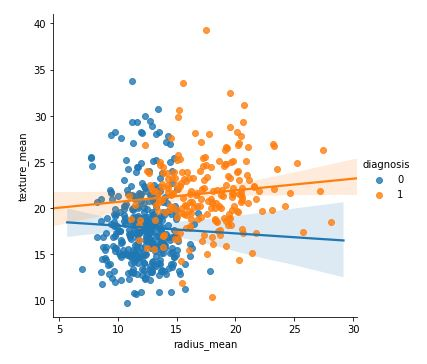

# Diagnosing cancer with the KNN algorithm


<div align="center">
  
[![Contributors][contributors-shield]][contributors-url]
[![Forks][forks-shield]][forks-url]
[![Stargazers][stars-shield]][stars-url]
[![Issues][issues-shield]][issues-url]

</div>

## Những việc sẽ làm (Table of contents)
- [Cài Đặt](#cách-cài-đặt-installation)
- [Mục đích dự án](#mục-đích-dự-án-project-purpose)
- [Sử Dụng](#cách-sử-dụng-usage)
- [Cấu trúc thư mục](#cấu-trúc-thư-mục-directory-structure)
- [Đóng Góp](#đóng-góp-contribution)
- [Tác giả](#tác-giả-author)
- [Bản Quyền](#giấy-phép-license)

## Mục Đích Dự Án (project purpose)

Dự án này tiến hành phân tích tập dữ liệu ung thư vú và sử dụng thuật toán phân lớp K-nearest neighbors để dự đoán cho tương lai

## Cách Cài Đặt (Installation)

1. Clone dự án về máy local của bạn (Clone the project to your local machine:):

    ```bash
    git clone https://github.com/davisduccopny/Stock-Prediction-with-Python-project.git
    ```

2. Di chuyển vào thư mục dự án (Navigate to the project directory:) :

    ```bash
    cd Stock-Prediction-with-Python-project
    ```

3. Tạo môi trường ảo (nếu cần) (Create a virtual environment (if needed)):

    ```bash
    virtualenv venv
    ```

4. Kích hoạt môi trường ảo (Activate the virtual environment):

    - Trên Windows (On Windows):

        ```bash
        venv\Scripts\activate
        ```

    - Trên macOS/Linux (On macOS/Linux):

        ```bash
        source venv/bin/activate
        ```
    - Trên môi trường streamlit (For the streamlit environment):
        ```bash
        pip freeze > requirements.txt
        ```
5. Cài đặt các thư viện cần thiết (Install the necessary libraries):

    ```bash
    pip install -r requirements.txt
    ```

## Cách Sử Dụng (Usage)

1. Chạy notebook `main_train.ipynb` để xem quy trình dự đoán chi tiết (view the detailed prediction process).

2. Tùy chỉnh các tham số và mô hình theo nhu cầu của bạn (Customize parameters and models according to your needs). 

3. Theo dõi các kết quả dự đoán và điều chỉnh mô hình để cải thiện hiệu suất (Monitor prediction results and adjust the model to improve performance).

## Cấu Trúc Thư Mục (Directory Structure)

- `dataset/`: Chứa dữ liệu lịch sử về giá cổ phiếu (Contains historical stock price data).
- `train_folder/`: Chứa các notebook Jupyter cho phân tích và dự đoán ( Contains Jupyter notebooks for analysis and prediction).
- `asset/image/`: Lưu trữ ảnh của dự án (Stores project images)
- `info_stock/`: Lưu trữ thông tin cổ phiếu (Stores stock information).
- `introduction`: Bản thảo word của dự án (Word draft of the project).
- `app_test.py`: Tệp chứa giao diện demo thuật toán (The file contains the algorithm demo interface)

## Đóng Góp (Contribution)

Nếu bạn muốn đóng góp vào dự án, hãy tạo một nhánh mới và gửi yêu cầu kéo (pull request). Chúng ta sẽ rất vui khi nhận được sự đóng góp của bạn!
(If you want to contribute to the project, create a new branch and submit a pull request. We would be delighted to receive your contributions!)

## Tác Giả (Author)

- Tên (Name): [Data Team - QuocChienDuc]
- Email: 2156210125@hcmussh.edu.vn
- Thành viên dự án (Project members):
    | Tên (Name)           | Mã Sinh Viên (Student Number) | Email                          |
    |----------------------|-------------------------------|--------------------------------|
    | Hoàng Xuân Quốc      | 2156210125                    | 2156210125@hcmussh.edu.vn      |
    | Đặng Hoàng Chiến     | 2156210095                    | 2156210095@hcmussh.edu.vn      |
    | Nguyễn Viết Đức      | 2156210100                    | 2156210100@hcmussh.edu.vn      |
- GitHub: [Your GitHub Profile](https://github.com/davisduccopny/)

## Giấy Phép (license)

Dự án này được phân phối dưới giấy phép [MIT License](LICENSE).

---
Happy coding!

[contributors-shield]: https://img.shields.io/github/contributors/davisduccopny/Stock-Prediction-with-Python-project?style=for-the-badge&label=Contributors 
[contributors-url]:https://github.com/davisduccopny/Stock-Prediction-with-Python-project/graphs/contributors 
[forks-shield]:https://img.shields.io/github/forks/davisduccopny/Stock-Prediction-with-Python-project?label=Folks&style=for-the-badge
[forks-url]: https://github.com/davisduccopny/Stock-Prediction-with-Python-project/forks
[stars-shield]: https://img.shields.io/github/stars/davisduccopny/Stock-Prediction-with-Python-project?style=for-the-badge&label=Stars
[stars-url]: https://github.com/davisduccopny/Stock-Prediction-with-Python-project/stargazers
[issues-shield]: https://img.shields.io/github/issues/davisduccopny/Stock-Prediction-with-Python-project?style=for-the-badge&label=Issues
[issues-url]: https://github.com/davisduccopny/Stock-Prediction-with-Python-project/issues
